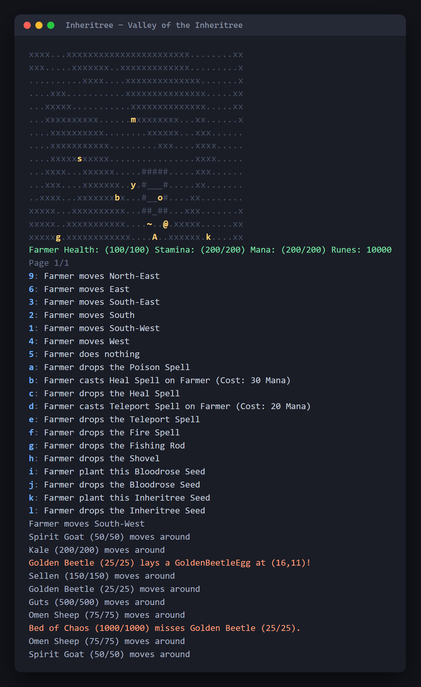

# Inheritree — a text-based RPG in Java

English | [日本語](README.ja.md)

A turn-based, text-rendered role-playing game inspired by *Elden Ring*, built
in Java on top of a small object-oriented game engine. The player is a Farmer
exploring two maps — the *Valley of the Inheritree* and *Limveld* — where the
land is cursed with Blight. Plant sacred trees to cure the ground, fight
creatures and a growing boss, cast spells, fish, trade with merchants and
talk to NPCs.

Developed by Haruto Iriyama as part of a five-person team over two design
iterations. The engine (`src/edu/…/engine`) was provided; everything under
`src/game` is the team's own code.



<sub>One turn: the map, the Farmer's status, the available actions, and the
turn log — a Golden Beetle laying an egg and the Bed of Chaos swinging at it.</sub>

## Features

| Area | What's there |
|---|---|
| **World** | Two maps linked by teleportation gates; ground types with capabilities (Blight, Soil, Floor, Wall, Pond, burning / temporary ground) |
| **Creatures** | Spirit Goat, Omen Sheep, Golden Beetle — each with priority- or random-based behaviour selection (wander, follow, attack, produce) |
| **Bed of Chaos boss** | A boss that *grows* every turn: branches and leaves are recursively spawned as `BossPart`s, and its attack power scales with the parts it has grown |
| **Eggs & hatching** | Creatures lay eggs; eggs hatch under rule-based conditions (timed, cursed-environment) and can be eaten for buffs |
| **Plants** | Inheritree and Bloodrose seeds; planting cures Blight, trees heal nearby actors, Bloodrose damages them |
| **Combat** | Weapon items (Broadsword, Katana, Dragonslayer Greatsword) and intrinsic weapons; attack actions driven by capabilities |
| **NPCs & trade** | Sellen, Kale and Guts with monologues that change with game state; merchants sell weapons whose purchase applies effects (heal, max-HP/stamina, spawn a creature) |
| **Spells** | Spellbook with Fire, Heal, Poison and Teleport spells that cost mana and apply effects to actors or ground |
| **Fishing** | Fishing rod and pond with weighted catch table (salmon, golden fish, toxic eel, old boot) plus a shovel to dig up plants |
| **Healing** | Talisman that cures cursed actors and ground |

### Design highlights

- **Composition over inheritance.** Behaviours (`AttackBehaviour`, `FollowBehaviour`, `WanderBehaviour`, `ProduceBehaviour`, `GrowPartBehaviour`) are plugged into actors through a `BehaviourSelector`, so a new creature is a configuration rather than a class hierarchy.
- **Conditions and effects as first-class objects.** `Condition` (low health, low runes, nearby capability, turn-based, …) and `Effect` (damage, heal, continuous damage, spawn actor, …) are small composable interfaces; NPC dialogue, merchant offers and spells all reuse them.
- **Capabilities, not `instanceof`.** Ground, items and actors advertise `GeneralCapability` / `GroundCapability` enums, and actions check capabilities, which keeps the engine and game decoupled.
- **Recursive boss growth.** `BedOfChaos` holds a tree of `Branch`/`Leaf` parts; growth is a recursive walk that lets branches sprout further branches or leaves, and damage is summed over the tree.

## What I built

Within the team I owned the creatures: how they reproduce, how their eggs
hatch, and the Bed of Chaos boss that grows itself.

**The Bed of Chaos — a boss that is a tree.** Rather than scaling the boss
with a counter, it holds a list of `BossPart`s and grows one more each turn.
The interface is two methods — `getDamageContribution()` and
`grow(actor, directParts)` — and the two implementations read very
differently through it:

| Part | Damage | What `grow()` does |
|---|---|---|
| `Branch` | 3 | Adds another `Branch` or a `Leaf` (50/50) |
| `Leaf` | 1 | Adds nothing — heals the boss by 5 instead |

Giving `Leaf` the same `grow()` method but a different meaning is what keeps
the boss from needing a type check anywhere. A `Branch` also sets
`isProductive = false` once it has sprouted a `Leaf`, so growth is
self-limiting instead of exponential. Attack power is never stored: before
each swing the boss re-sums its parts and writes the total into its weapon
(`BASE_DAMAGE + getDamageContribution()`), so the number can never drift
from the tree it describes.

One detail worth calling out: `attemptGrow()` walks the part list with an
index-based `while` loop rather than a for-each, because the loop body adds
to the very list it is iterating — a for-each would throw
`ConcurrentModificationException` the moment a branch sprouted.

**Growth as a behaviour, not a special case.** The boss does not know *when*
to grow. `GrowPartBehaviour` checks the surrounding tiles and returns `null`
if any adjacent square holds an actor, which hands the turn to the attack
behaviour in the `BehaviourSelector`. The boss therefore only grows while
nothing is in reach, and that rule lives in one place. The behaviour depends
on a `Growable` interface (`attemptGrow()`), not on `BedOfChaos`, so anything
else in the game could grow the same way.

**Reproduction driven by each creature's own rule.** `ActorProducible`
(`canProduceOffspring` / `produceOffspring`) lets one `ProduceBehaviour`
serve three creatures with completely different conditions:

| Creature | Produces when |
|---|---|
| Golden Beetle | A fixed number of turns has passed |
| Omen Sheep | A fixed number of turns has passed |
| Spirit Goat | A `BLESSED` capability is on an adjacent tile |

The Spirit Goat's condition reuses `NearbyCapabilityCondition`, so "look
around for X" is not re-implemented per creature.

**Hatching as data instead of branches.** An egg exposes a list of
`HatchingRules`, each a pairing of a `Condition` with a
`Supplier<Actor>`:

```java
new HatchingRules(new NearbyCapabilityCondition(location, GeneralCapability.CURSED),
                  GoldenBeetle::new)   // Golden Beetle egg: hatches on cursed ground
new HatchingRules(new TurnBasedCondition(turnOnGround, HATCH_DURATION),
                  OmenSheep::new)      // Omen Sheep egg: hatches after N turns
```

The `Supplier` matters: the creature is only constructed if the condition
passes, so a rule can be declared without building the actor it might one
day produce. Adding a new egg means adding a rule, not editing a chain of
`if` statements — and because an egg is also an `Item` and `Eatable`, the
same object can be picked up, dropped or eaten for a buff.

I also wrote `FollowBehaviour`, the `GeneralCapability` enum the conditions
above query, and the boss's weapon and attack action.

## Running

Requires JDK 17+.

```bash
javac -d out $(find src -name "*.java")
java -cp out game.Application
```

Or open the project in IntelliJ IDEA and run `game.Application`. The game is
played in the terminal: each turn lists the available actions and you type
the key of the one you want.

## Documentation

- `docs/design/game.png`, `docs/design/engine.png` — class diagrams of the game and engine packages
- `docs/design/uml_spells_and_fishing.png` — UML for the spell and fishing systems
- `docs/design/iteration-1/`, `docs/design/iteration-2/` — design rationale, UML and sequence diagrams for each feature in the two iterations
